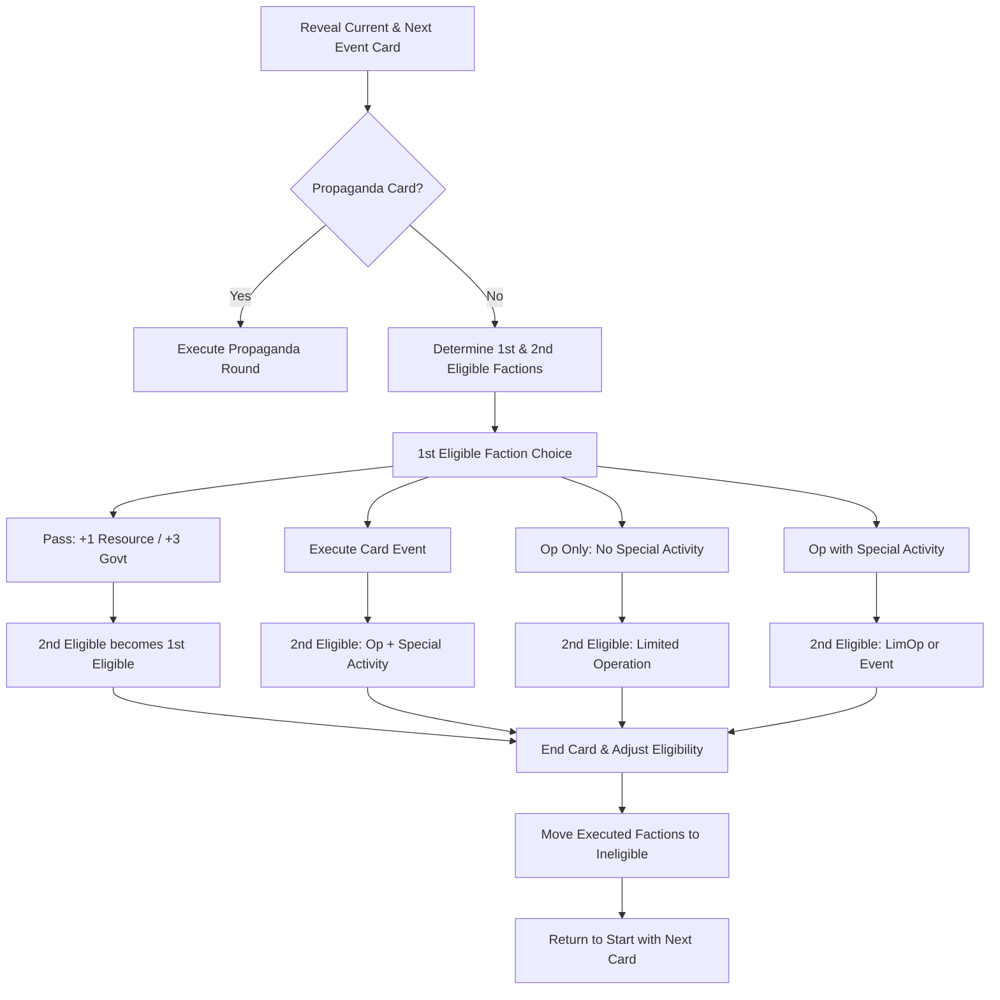

```mermaid
graph TD
    A[Reveal Current & Next Event Card] --> B{Propaganda Card?}
    B -- Yes --> C[Execute Propaganda Round]
    B -- No --> D[Determine 1st & 2nd Eligible Factions]
    
    D --> E[1st Eligible Faction Choice]
    
    E --> F1[Pass: +1 Resource / +3 Govt]
    E --> F2[Execute Card Event]
    E --> F3[Op Only: No Special Activity]
    E --> F4[Op with Special Activity]
    
    F1 --> G1[2nd Eligible becomes 1st Eligible]
    F2 --> G2[2nd Eligible: Op + Special Activity]
    F3 --> G3[2nd Eligible: Limited Operation]
    F4 --> G4[2nd Eligible: LimOp or Event]
    
    G1 --> H[End Card & Adjust Eligibility]
    G2 --> H
    G3 --> H
    G4 --> H
    
    H --> I[Move Executed Factions to Ineligible]
    I --> J[Return to Start with Next Card]
```