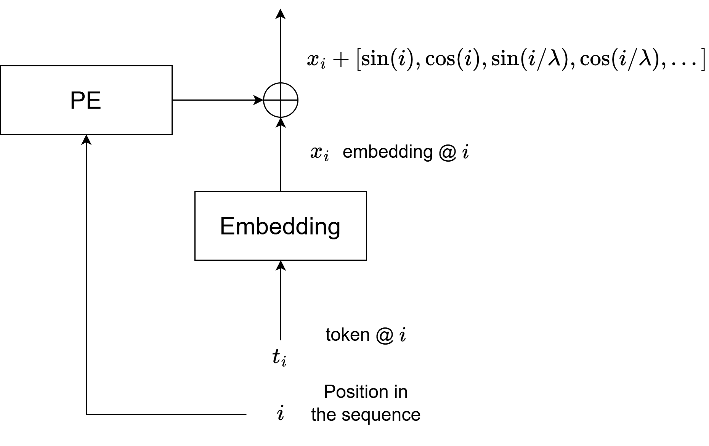
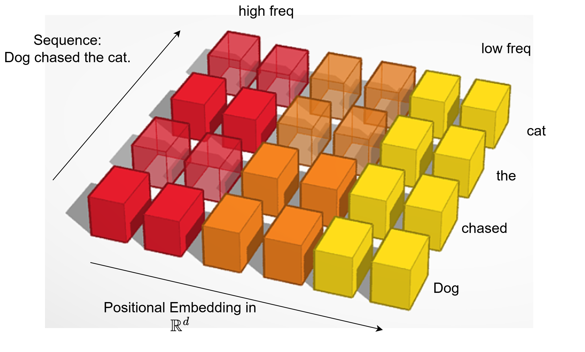
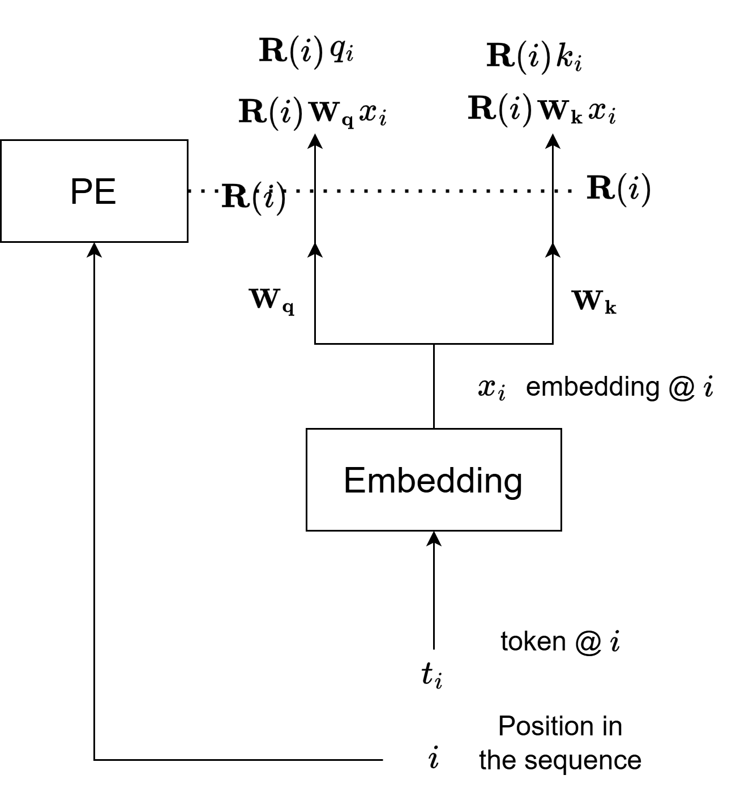
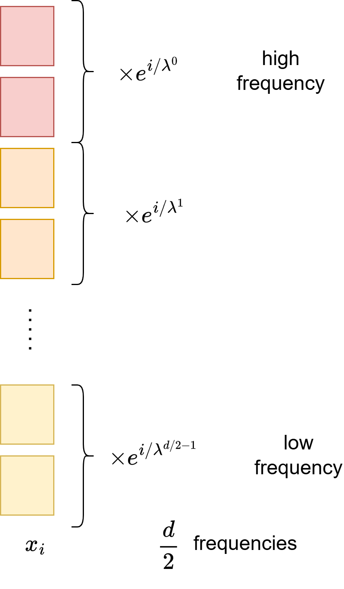
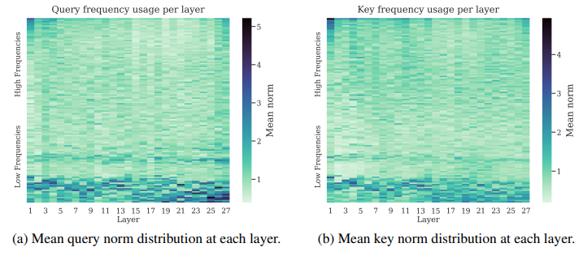
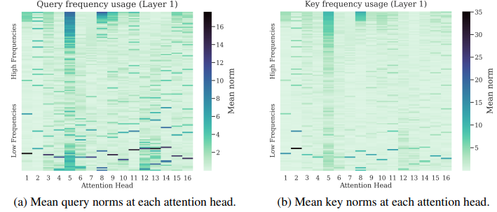
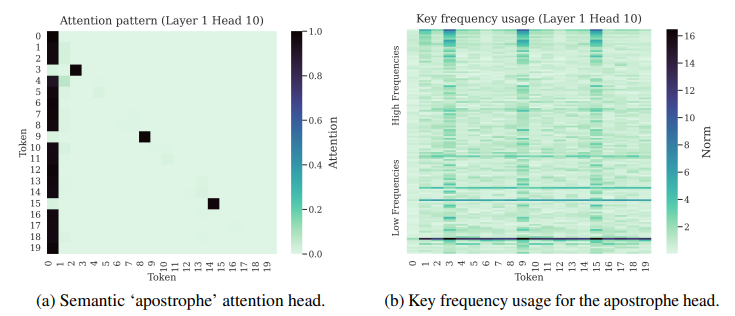
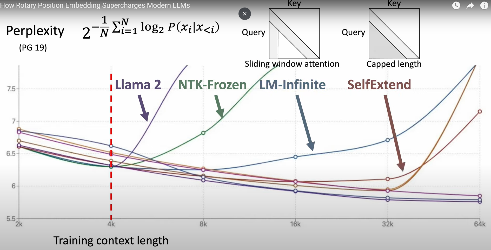

## Block diagram ASPE

---

## Abs sin pos enc

<!--
$x_1$ $x_2$ ... $x_{sl}$

$x_i \in \mathbb{R}^d$

$i$ the position in the sequence
-->

---

## Review of attention score (Part 1)

$\alpha_{i,j}$ attention coefficient from $j$ token to the $i$ token (activation)

In our example $\alpha_{cat, Dog}$, says how much the word **Dog** is attending to the word **cat**.

$a_{i,j}$ attention activation (logit) (all plots)

---

## Review of attention score (Part 2)

$\alpha_{i,j} = \frac{e^{\bf{a_{i,j}}}}{\sum_{l\le i} e^{\bf{a_{i,l}}}}$

 $\begin{aligned}
a_{i,j}
 &= \bf{q}_i^T  \bf{k}_j\\
 &= [\bf{W_q}(\bf{x}_i + pe(i))]^T W_k(\bf{x}_j + pe(j))
\end{aligned}$

---

## Issue with ASPE

Ignoring $\bf{x_i}$, $\bf{W_q}$, and $\bf{W_k}$

$[... s(i/\lambda^k) ...]^T[... s(j/\lambda^k) ...] =$

$[... s(i/\lambda^k) s(j/\lambda^k) ...]$

product of sinusoids depends on both $i-j$ (good) and $i+j$ (bad)

Note:
$\sin(A)\sin(B) = [\cos(A-B) - \cos(A+B)]/2$
$\cos(A)\cos(B) = [\cos(A-B) + \cos(A+B)]/2$

---

## Why relative positions are good

> I walked my dog in the morning.

> In the morning, I walked my dog.

Both have same meaning, only the relative word positions in a phrase matter.

---

## RoPE intuition in 2D

dot($e^{i\theta}, e^{i(\theta + \delta)})$ = $e^{-i\delta}$

in 2D matrix notation

$R(\theta) R^T(\theta + \delta) = R(-\delta)$

---

## Revisit attention

$\begin{aligned}
a_{i,j}
 &= kernel(\bf{q}_i,  \bf{k}_j)
 \end{aligned}$
 
 $
 = [{\mathbf R(i)}\mathbf{W_q}\mathbf{x_i}]^T [{\mathbf R}(j) \mathbf{W_k} \mathbf{x_j}] \\
 $

 $
 = [\mathbf{W_q}\mathbf{x}_i]^T {\mathbf R}(j-i) [\mathbf{W_k}\bf{x}_j] 
 $

---

## Block diagram RoPE

 

---

## 2D to $\mathbb{R}^d$

$$
\begin{pmatrix}
  \begin{pmatrix}
  \sin (\theta/\lambda^0) && -\cos (\theta/\lambda^0)\\
  \cos (\theta/\lambda^0) && \sin (\theta/\lambda^0)\\
  \end{pmatrix} \\
& \ddots \\
& & 
  \begin{pmatrix}
  \sin (\theta/\lambda^{d/2-1}) && -\cos (\theta/\lambda^{d/2-1})\\
  \cos (\theta/\lambda^{d/2-1}) && \sin (\theta/\lambda^{d/2-1})\\
  \end{pmatrix} 
\end{pmatrix}
$$

i.e. rotate every two rows in $W_{q,k} x_{\theta}$

Note: paper $\lambda = 10000^{2/d}$, and call $10000$ the base wavelength

---

 

---

## Plots of $||q^{(k)}_i|| ||k^{(k)}_j||$

Note: mean over 10 different Shakespeare quotes and 16 attention heads.  Note that most middle layers, learn to have high norms in the low frequencies.  High frequency components at beginning and end layers.

---

## Plots of q, k norms at layer one vs attention head

Note: head 5 and 8 have high frequency components

---

## Plot of head 8

Note: This shows that diagonal pattern (only attend to self), and a next token pattern (attend to previous token).

---

## Key take aways

Attention head can learn very sharp patterns (diagonal, previous-token).

NoPE (no positional encoding) heads cannot learn such patterns.

Note: NoPE can learn positional encoding via the mask, but need to apply universal approximation theorem.

---

## Low freq bands

1. Not affected by relative position
1. Useful for detecting token "semantics"
1. Misalignment can happen at long distances
   - LLama 3 changed base wavelength from 10000 to 50000

---

## Apostrophe head

Previous token pattern with strong attention to BOS.

---

## Misalignment at long context lengths

--- 

## Ways to increase the context length

1. increase base wavelength $\lambda_B$ (10000).
   - modifies all frequencies
     $f_k = \frac{1}{\lambda_B^{\frac{2k}{d}}}$
   - lose resolution at high/mid frequencies

---

## Interpolation

   $i' = \alpha i$
   - $\alpha=\frac{\text{train context length}}{\text{target context length}}$
   - allow extrapolation to longer sequences
   - don't need to retrain
   - "NTK - aware" interpolation

Notes: 

NTK: basically you stretch the original kernel (2k long) over a longer sequence (e.g. 10k long)

Variants that operate on $\alpha_j$
- NTK-RoPE gradually transition from RoPE high frequency to target low frequency.
- YaRN "NTK-by-parts" piecewise extension
    - equal to RoPE at high frenquencies for frequencies > $p$
    - equal to target at low frenquencies for frequencies < $q$
    - linear interpolation between $q < f_k < p$

---

## p-RoPE

$p$ is the fraction of RoPE that is kept.

$p=0.75$ has lower perplexity.

---

## 🔁 Rotary Positional Embedding (RoPE) Recap

RoPE encodes positions by applying a **complex rotation** (or 2D rotation) to the query/key embeddings based on position and frequency:

$$
\text{RoPE}(x, p) = x \cdot R(p)
$$

---

Where:

* $R(p)$ is a position-dependent rotation matrix using sinusoidal functions.
* Frequencies are chosen such that lower dimensions rotate slowly, higher ones faster.

Frequencies are defined as:

$$
f_k = \frac{1}{\text{base}^{\frac{2k}{d}}}
$$

Default **base = 10,000**, as in the original Transformer.

---

Refs:
- [SuperHOT](https://kaiokendev.github.io/context)
- [Meta](https://arxiv.org/pdf/2306.15595)
- [Reddit](https://www.reddit.com/r/LocalLLaMA/comments/14lz7j5/ntkaware_scaled_rope_allows_llama_models_to_have/)
- [Cornell](https://arxiv.org/pdf/2409.12181)
- [JiaBinHuang](https://www.youtube.com/watch?v=SMBkImDWOyQ)
- [DeepLearningHero](https://www.youtube.com/watch?v=GQPOtyITy54)
---

Perplexity = $2^{-{1}{N}\sum_{i=1}^{N} \log_2 P(x_i | x_{<i})}$

yes, Greg Makowski talk is on ACM youtube