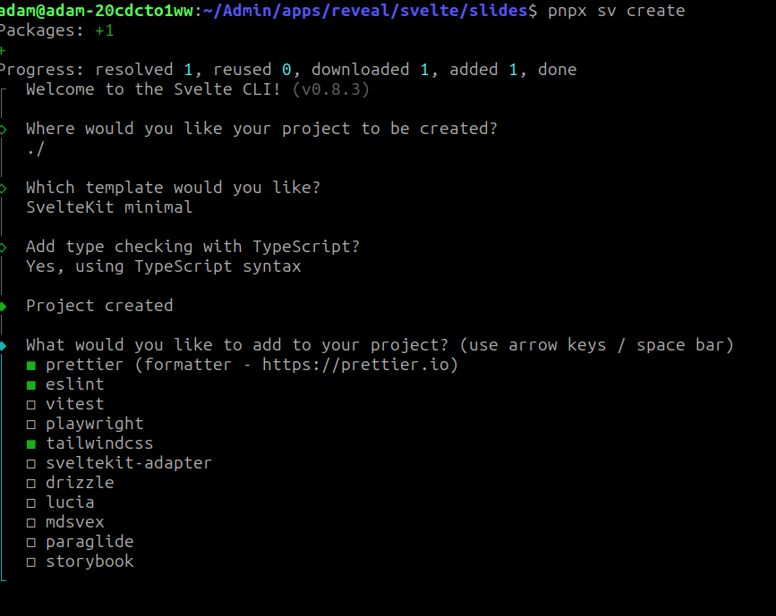
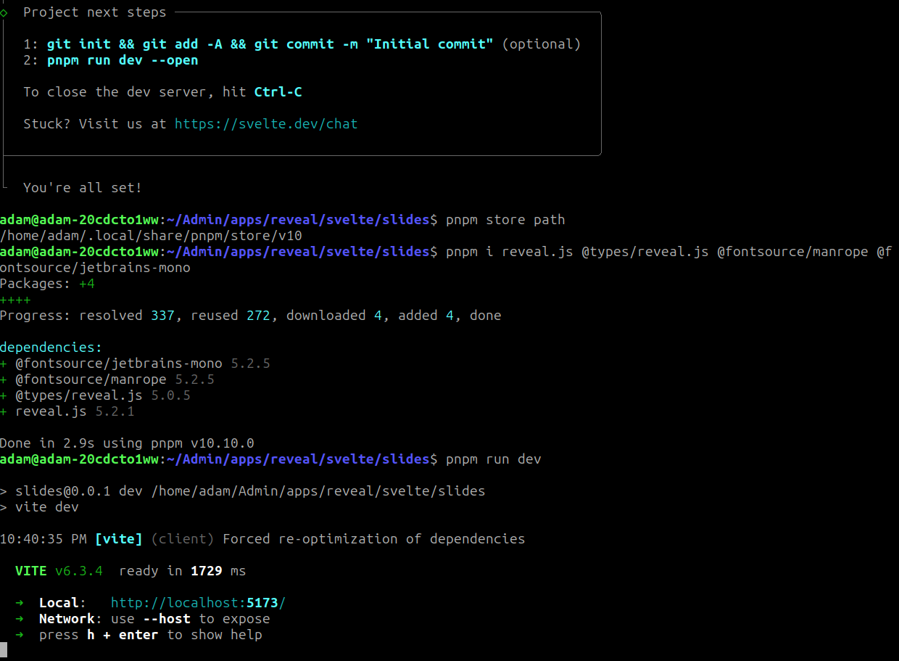

# install pnpm
`curl -fsSL https://get.pnpm.io/install.sh | sh -`

# create project
`pnpm sv create`

# install reveal and some fonts
`pnpm i reveal.js @types/reveal.js`
`pnpm run dev --open`

# follow instructions
[joyofcode](https://joyofcode.xyz/beautiful-presentations-with-svelte)
