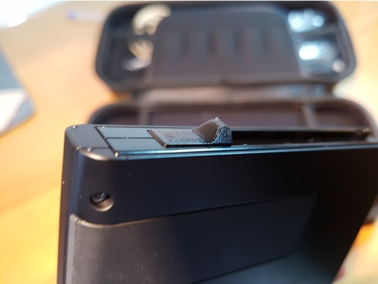

# Launching the payloader via Fusée Gelée

## Video instructions
ATTENTION!!! We do not recommend blindly following the video instructions! Use them only as a guide! The text guide is constantly updated. It's impossible to keep track of all the updates and update the video guide each time! Therefore, the text guide will always be more accurate and up-to-date than the video!

[boot payload](https://youtu.be/jxrkxHPfec8)

Video instructions

This page is for informational purposes only. It doesn't cover the actual installation of custom firmware; it only provides theoretical information. The practical aspects will be covered later, as you complete the guide.

# Information about Fusée Gelée
Some NVIDIA Tegra mobile processors released before 2016 contain a buffer overflow vulnerability in BootROM recovery mode ( RCM) ▼ ). An attacker with physical access to the device's USB port and the ability to forcefully reboot the device into RCM ▼ , can exploit the vulnerability to execute untrusted code.

▼ Recovery mode is available on devices with an Nvidia Tegra processor, which includes the Switch. Specifically, on the Switch, it's accessed by simultaneously pressing the power button, volume up button, and connecting specific contacts on the tablet using a special contactor. All Nintendo Switches have RCM, but not all can be flashed from this mode.

Fusée Gelée is a chain of exploits for the Nintendo Switch built around a hardware vulnerability in the Nvidia Tegra chip. It allows unsigned code to be run on the Nintendo Switch. Since the vulnerability is hardware-based, it cannot be patched without changing the hardware revision. However, the latest versions of the console are free of this vulnerability, so be careful when purchasing a device for flashing. You can find out if your console can be flashed here. [check](https://nswtl.info/switch-ru/get-started.html)

# What is RCM?
RCM is the default recovery mode on Tegra devices. To enter it, turn off the console and then press (POWER) + (VOL+) + (HOME). Not the (HOME) button you see on the right Joy-Con, but the button NVIDIA Tegra identifies as such. Unfortunately, it's not on the console itself. We'll need to turn off the console, short a specific contact where the right Joy-Con attaches to ground (using a shorting device), connect the console to the PC, and send a payload to it using any convenient method. We'll cover how to do this in more detail below.

# How does it all happen?
In general, the chain is as follows: you insert a contactor into the attachment, enter it into the RCM ▼ and transfer the payload to it, which in turn executes code on the console itself. The payload, also known as the payload ,▼ , can be transferred via a PC, smartphone or a special dongle ▼ , created exclusively for this purpose. For simplicity, we'll call any device capable of transmitting a payload a host . To simplify firmware installation, the host can be built into the [console](https://gbatemp.net/threads/internal-modchip-samd21-trinket-m0-gemma-m0-itsybitsy-m0-express-guide-files-support.508068/) itself . A host built into the console is called a chip . The difference between a chip and a dongle is primarily that the former is always present in the console, launches the payload immediately upon power-on, and also monitors the console's battery to ensure it doesn't drain completely. It's important to understand that this isn't the same chip used to hack Mariko consoles and patched first-revision consoles. In this case, the chip simply replaces the dongle. With Mariko chipping, the chip itself is the hack. This means that on a Mariko console, you won't be able to hack the console at all without a chip, but in the case of a console vulnerable to Fusée Gelée, you can easily do without a chip by passing the payload through a dongle or a PC.

 ▼ payload A file with executable code in the format .bin that we load into the console, most often a bootloader

 ▼ dongle A special small device whose only purpose is to send payload to the console.

# What you will need
- **Closer**
- **Host**
- Memory card (recommended capacity 64 GB or more, for OLED - 128 or more)

## Closer
To properly activate the circuit, we'll need to short-circuit pins 9 and 10 (or pins 7 and 10, or pins 1 and 10—all options work equally well) at the right controller's installation location. This can be accomplished in several ways:

- Use a regular [paper clip](https://www.reddit.com/r/SwitchHacks/comments/8f0ugz/hardwarediy_switch_paperclip_jig_for_rcm_mode/)
- More [methods](https://nh-server.github.io/switch-guide/user_guide/emummc/entering_rcm)
- Use a [3D printed](https://www.thingiverse.com/thing:2877484) contactor or buy one on Aliexpress.
- And [other ways](https://gbatemp.net/threads/the-ultimate-list-of-mods-to-enter-rcm.502145/)

Further in the instructions, the word “shorter” will mean any of these methods

## Host
You can use the following as a host:

- Dongle
- PC
  - You'll also need a USB-C to USB-A cable to connect the console to your PC. Please note that the cable must support data transfer !
- Mobile phone
  - You'll also need a USB-C to USB-C cable to connect the device to your phone, or a USB-C to USB-A cable and an OTG adapter. Your phone must also support OTG. If you have an iPhone, it must be jailbroken!

# Instructions
## Part I - Entering RCM
1. If there is a cartridge inserted into the console, remove it.
1. Turn off the console
1. Disconnect the right joy-con and insert the locking device into the right joy-con guide until it stops.

1. Press and hold (VOL+) and turn on the set-top box without releasing the volume button
1. Can you get the switch?

Nothing should happen on the console's screen. If the screen remains black after connecting the cable, you're doing everything correctly! If the screen lights up with the word "Nintendo," unplug the console and try again.

It may not work for the following reasons:

- The wrong contacts are closed
- The contactor doesn't close anything, for example, the wire is broken and the contacts don't close, or it was initially assembled with errors
- The buttons are not pressed simultaneously. Try holding down (VOL+) first, and then, without releasing it, press (POWER)

## Video instructions
ATTENTION!!! We do not recommend blindly following the video instructions! Use them only as a guide! The text guide is constantly updated. It's impossible to keep track of all the updates and update the video guide each time! Therefore, the text guide will always be more accurate and up-to-date than the video!

[video](https://youtu.be/jxrkxHPfec8)

Video instructions

If successful, nothing will appear on the screen. If unsuccessful, the official firmware will launch.

## Part II - Payload Forwarding

By this point the set-top box should already be in RCM mode!

Depending on the situation, the payload forwarded may vary. We intentionally don't specify which payload to forward on this page. This will be explicitly stated on the relevant pages. Most often, you'll forward hecate, which is found in kefir in the form of  payload.bin 

# Launch via dongle
A dongle is a standalone device that is designed solely to easily launch a hack.

## What you will need
Dongle ▼ It must be charged with the included cable or inserted into the switched-on set-top box.

- The dongle itself ▼ A special small device whose only purpose is to send the payload to the console.
- Installed on the hekate dongle▼

  - Instructions for [R4S](./guide03_03_r4s.md)
  - RCMLoader [Instructions](./guide03_04_rcm_loader.md)

- The set-top box must be in RCM mode.

## Instructions
- To run the custom firmware, insert the dongle into the set-top box.
  - The set-top box must be in RCM mode .
- To run hekate ▼ just insert the dongle ▼ When the kefir splash screen appears on the console, press the volume down button.
- To run any other payload, read on.

 ▼ hekate A custom bootloader for Nintendo Switch. We use it to make backups, launch custom files, and run various payloads. It's one of the most important tools we'll be using.

### What you will need
- Payload ▼ which you are going to run
  - To run hekate ▼ it must be flashed into the dongle ▼ , there is no need to dump it anywhere else
- The set-top box must be in RCM mode.

Below is a description of how to run any payload using a dongle. ▼ , on which hekate is stitched▼

1. Install kefir on the console ▼
2. Insert the dongle into the console
3. When the splash screen of kefir appears, press (VOL-), you will get to hecate
4. While in Hekate, go to Tools -> USB Tools -> SD Card . Your memory card will be mounted on your PC.
   - In fact, your switch will be used as a card reader.
   - Instead, you can simply remove the memory card from the console and insert it into the PC, but it is best to train yourself not to do this, since the memory card slot on the console is quite flimsy.
5. Place the payload ▼ , which you are going to run in the folder  bootloader/payloads 
6. Safely remove your memory card from your PC (the device will be called “ UMS ”) and click “ Close ” in the hex key.
   - If you removed the card from the console, simply insert it back into the console.
7. In Hekate, go to the main menu and click Payloads... -> %your_payload%.bin
8. The payload will launch on the console.
Launch via dongle

# Running on Windows
## What you will need
- The latest version of TegraRcmGUI [tegraGUI](https://github.com/eliboa/TegraRcmGUI/releases/latest)
- Payload ▼ which you are going to run on the console
- USB Type-C to USB Type-A cable for connecting Switch to PC
- The set-top box must be in RCM mode.
## Installing drivers
If the drivers have already been installed, skip this part.

1. Run as Administrator  TegraRcmGUI.exe [tegra](https://github.com/eliboa/TegraRcmGUI/releases/latest)
2. Go to the tab  Settings  and click “ Install Driver ”
3. Install the driver
4. After the driver is successfully installed, close the program.
## Launching the payload
1. Connect the set-top box in RCM mode to the PC
2. Run as Administrator  TegraRcmGUI.exe [tegra](https://github.com/eliboa/TegraRcmGUI/releases/latest)
3. 

1. Click the button   and select the payload you want to run.
2. Click the “ Inject Payload ” button to send the payload to the console.
3. The payload will launch on the console.
   - If the payload doesn't launch, check that the drivers are installed correctly. A properly installed device driver will appear in Device Manager as  libusbK USB Devices 
   - Try transmitting the payload again.
   - You can use the button + to add the payload to your favorites.
Running on Windows

# Launching on macOS
## What you will need
- Payload ▼ which you are going to run on the console
- USB Type-C to USB Type-A for connecting Switch to Mac
- The set-top box must be in RCM mode.
## Installing NXBoot
There are two ways to install and run NXBoot:

In manual mode

To install the NXBoot utility, which will deliver payloaders to the console, you need to open the Terminal program and paste the following code:

 sudo curl -L https://mologie.de/~oliver/mologie.github.io/nxboot/bin/nxboot -o /usr/local/bin/nxboot && sudo chmod +x /usr/local/bin/nxboot 

Thus, in one operation, the utility is downloaded from the official website [nxboot](https://mologie.github.io/nxboot/) , saved in a directory  /usr/local/bin/  so that the path to the file is not specified upon launch, and execution rights are set.

Automatically

To automatically load NXBoot and deliver the payload to the console, you need to run the PayloadStarter [payload starter](https://github.com/KnightOfSteel/payload_starter/releases) program and select the desired payload .▼ .

## Launching the payload
There are also two ways to launch the payload:

In manual mode.

The set-top box must be in RCM mode.

1. Open the Terminal program and run the following command:  nxboot /путь/до/пейлоада 
   - The path must be specified directly before  .bin  the payload file.
   - To avoid entering the path manually, you can type it in the terminal  nxboot  and drag  .bin  the payload file there with the mouse.
   - If the payload does not start, most likely the console is not in RCM mode.
2. After successful completion  nxboot  , you will see the following text on the screen  success: payload was run. exiting, fair winds! 
3. You can take out the switch.

In automatic mode.

The set-top box must be in RCM mode.

1. Connect your Switch to your computer
2. Launch PayloadStarter
3. Select the required one  payload.bin 
4. Wait for the process to complete (depending on your internet connection and computer speed)
5. If everything went well, then the selected payload will start on your Switch and you can get the switch
Launching on macOS

# Launch on Android
## What you will need
- Payload ▼ which you are going to run on the console
- An Android device that works with OTG
- USB Type-C to USB Type-C to connect Switch to an Android device, or an OTG adapter
- Installed Rekado program [redako](https://github.com/MenosGrante/Rekado/releases/latest)
- The set-top box must be in RCM mode.
## Launching the payload
1. Launch Rekado on your Android smartphone
2. Go to the “ Payloads ” section and grant permission to work with the drive if the program asks for it.
3. Click on the button  +  and select the payload you need to launch.
4. Connect Switch to your device using a cable
5. The phone will ask whether to use Rekado as the default connection. Answer yes.
6. Click “ Boot Payload ” and select your payload.
Launch on Android

# Runs on any platform that has a browser
## What you will need
- Payload ▼ which you are going to run on the console
- USB Type-C to USB Type-A cable for connecting Switch to the host ▼
- Chrome Browser (will not work with other browsers!)
- The set-top box must be in RCM mode.
## Launching the payload
The set-top box must be in RCM mode !

1. Open this web page. [sdsetup](https://webcfw.sdsetup.com/)
2. In the “ Payload Sending Settings ” section, select a payload from the “ Upload your payload ” list, click “ Choose file ”, and then select  .bin  your payload file.
   - Don't select a payload from the list! Use the one in the archive, otherwise you risk getting an error at one stage or another!
3. Click “ Deliver payload! ”
4. In the window that opens, select “ APX ” and click “ Connect ”
5. The payload will launch on the console.
6. You can take out the switch.
Runs on any platform that has a browser
Next Step: Preparatory Work [prep](./guide04_01_prep_fusee.md)