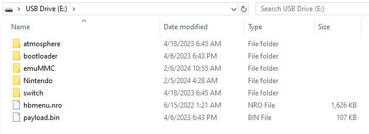

# NH Switch Guide

Main Navigation
User Guide
Homebrew
Tutorials
FAQ
About


Menu
On this page
Sidebar Navigation
User Guide
Getting Started

RCM
RCM

Entering RCM

Sending a Payload

Modchip
Introduction to Modchips

Payload and bootloader folder placement

CFW on sysMMC vs. CFW on emuMMC

Multiple Options
Partitioning the microSD Card and creating the emuMMC

Formatting and/or partitioning the microSD Card

microSD Card preparations

Making Essential Backups

Launching CFW

Other
FAQ

About

## microSD Card preparations

We will now place the required files for the Atmosphère custom firmware and some additional homebrew files on the microSD card.

Atmosphère has its own bootloader, called fusee. For the purposes of this guide we will be using hekate instead, so that we can back up the system's NAND (internal storage) and take advantage of other advanced features in the future.

### File name extensions

If you use Windows, you should enable file name extensions before continuing. See this link for a guide on how to do this.

### What you need:
- The latest release of hekate (Download the hekate_ctcaer_(version).zip release of hekate)
- The hekate config file: hekate_ipl.ini
- The DNS.MITM DNS redirection config: emummc.txt
- The bootlogo zip folder: bootlogos.zip
- The latest release of Atmosphère. Download the atmosphere-(version)-master-(version)+hbl-(version)+hbmenu-(version).zip release of Atmosphère.
- The latest release of JKSV (Download the JKSV.nro release of JKSV)
- The latest release of FTPD (Download the ftpd.nro release of FTPD)
- The latest release of NXThemesInstaller (Download the NXThemesInstaller.nro release of NXThemesInstaller)
- The latest release of NX-Shell (Download the NX-Shell.nro release of nx-shell)
- The latest release of Goldleaf (Download the Goldleaf.nro release of Goldleaf)

### About ChromeOS

If you're on a Chromebook, the following section may prove to be difficult. The native file manager on ChromeOS does not support basic file manager functionalities such as replacing and/or merging files/folders. Please verify your file and folder placement using the "Full folder/file structure" section near the bottom of this page.

### Instructions:

- Navigate to the accessible drive.

- Copy the contents of the Atmosphère.zip file to the root of your microSD card.

- Copy the bootloader folder from the hekate .zip file to the root of your microSD card.

  - If you're asked to replace files or merge folders, do so.
  - On macOS, you will need to merge folders, not replace them.

- Copy the bootloader folder from the bootlogos.zip file to the root of your microSD card.

  - If you're asked to merge the bootloader folders, do so.

- Copy hekate_ipl.ini to the bootloader folder on your microSD card.

  - If you're asked to replace the file, do so.

- Create a folder named hosts inside the atmosphere folder on your microSD card, and put emummc.txt inside of the hosts folder.

- Copy JKSV.nro, ftpd.nro, NxThemesInstaller.nro, NX-Shell.nro and Goldleaf.nro to the switch folder on your microSD card.

- If you were already using your microSD card as a storage device for your games and backed up the Nintendo folder before partitioning your microSD card, please place it back on the root of your microSD card now.

- If you created an emuMMC on the previous page; don't forget to copy the Nintendo folder to sd:/emuMMC/RAW1/, in addition to the Nintendo folder on the root of your microSD card.
About emummc.txt

Putting the emummc.txt file provided by this guide into /atmosphere/hosts will prevent your emuMMC (emuNAND) from connecting to Nintendo. Not doing this will likely result in a ban.

Your microSD card should look similar to the image below. The Nintendo folder will not be present if your Switch has not already booted with the microSD card inserted and the emuMMC folder will not be present if you're following the sysCFW path of the guide/you haven't created an emuMMC! The payload.bin file will not be present if you're using an unpatched Switch, as it's only for modchipped console users.

If you'd like to check the full folder/file structure of your microSD card, unfold the "Full folder/file structure" section below.

```
SWITCH SD:
├── atmosphere
│   ├── config
│   ├── config_templates
│   │   ├── exosphere.ini
│   │   ├── override_config.ini
│   │   ├── stratosphere.ini
│   │   └── system_settings.ini
│   ├── fatal_errors
│   ├── flags
│   ├── hbl_html
│   │   └── accessible-urls
│   │       └── accessible-urls.txt
│   ├── hbl.nsp
│   ├── hosts
│   │   └── emummc.txt
│   ├── kip_patches
│   ├── package3
│   ├── reboot_payload.bin
│   └── stratosphere.romfs
├── bootloader
│   ├── hekate_ipl.ini
│   ├── ini
│   ├── payloads
│   ├── res
│   │   ├── emu_boot.bmp
│   │   ├── icon_payload.bmp
│   │   ├── icon_switch.bmp
│   │   ├── stock_boot.bmp
│   │   └── sys_cfw_boot.bmp
│   ├── sys
│   │   ├── emummc.kipm
│   │   ├── l4t
│   │   │   ├── bpmpfw_b01.bin
│   │   │   ├── bpmpfw.bin
│   │   │   ├── mtc_tbl_b01.bin
│   │   │   ├── sc7entry.bin
│   │   │   ├── sc7exit_b01.bin
│   │   │   └── sc7exit.bin
│   │   ├── libsys_lp0.bso
│   │   ├── libsys_minerva.bso
│   │   ├── nyx.bin
│   │   ├── res.pak
│   │   └── thk.bin
│   └── update.bin
├── emuMMC
│   ├── emummc.ini
│   └── RAW1
│       ├── Nintendo
│       │   ├── Album
│       │   ├── Contents
│       │   └── save
│       └── raw_based
├── hbmenu.nro
├── Nintendo
│   ├── Album
│   ├── Contents
│   └── save
├── payload.bin
└── switch
    ├── daybreak.nro
    ├── ftpd.nro
    ├── Goldleaf.nro
    ├── haze.nro
    ├── JKSV.nro
    ├── NX-Shell.nro
    ├── NXThemesInstaller.nro
    └── reboot_to_payload.nro
```


sdfilesimg

Continue to Making Essential Backups