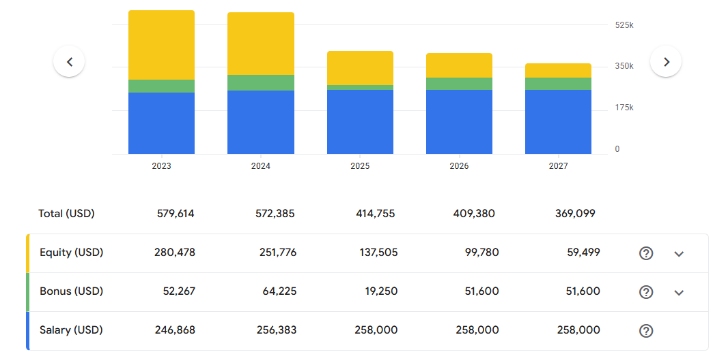
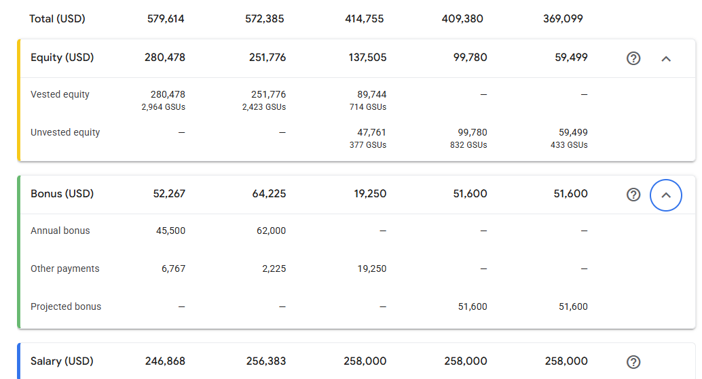

# Job Details

https://stockplan.morganstanley.com/solium/servlet/ui/activity/reports/statement

904459
Staff Software Engineer
Software Engineer
Employee
2 Individual Contributor
Full time
FTE
100.00%
US-SVL-BORD1212
Hire Date 11/30/2020
Leave Date 10/01/2025

Length of Service
Length of Service
4 year(s), 9 month(s), 23 day(s)
Contact Information - Public
frankieliu@google.com
Work Address
1212 Bordeaux Drive Sunnyvale, CA 94089 United States of America

US - STD: 04/10/2025 - 07/09/2025
US Extended STD: 07/10/2025 - 08/17/2025

Compensation
$258,000.000
Company Bonus 20% (2020)
01/06/2021 Stock Grants 582 RSU
Grant ID C764680
Stock Plan C2012

[x] Step 1: Understand your sales and company plan bonus eligibitlity
[x] Step 2: Contact immigration
[ ] Step 3: Understand benefits
## Vacation: 
## Benefits:
[ ] check when they elapse

Step 4: Information on Workday
- [x] bank details
- [x] permanent address
- [x] mailing address
- [x] phone number
- [x] personal email

Step 5: Accept GSU
Contact gem-help@google.com

# Step 6: Review your offer letter before you leave

# Step 7: Clean up the drive file access

# Step 8: Clean up your Google Cloud resources

# Step 9: Transfer  your personal photos out of Google Photos

# Step 10: Complete the exit survey

[x] # Step 11: Continued access to MyPay
- go/mypayaccess - replaced 
- https://googlemypay.ultipro.com

Step 2: If you have any questions, follow up after you leave

Please save the following emails!

Contact peopleops-help@google.com if you have questions after you leave Google or to notify Google of a change of address. IMPORTANT: This email alias is designed for external senders only. If you're emailing from an @google.com address, your message won't be delivered.

Contact verifications@google.com to request documents verifying your employment information.

Contact benefits-support-external@google.com if you have any questions after you leave Google specifically relating to your benefits.
