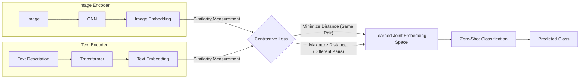

```mermaid
graph TD;
    A-->B;
    A-->C;
    B-->D;
    C-->D;
```

```mermaid
graph LR
    subgraph Image Encoder
        A[Image] --> B[CNN]
        B --> C[Image Embedding]
    end
    
    subgraph Text Encoder
        D[Text Description] --> E[Transformer]
        E --> F[Text Embedding]
    end

    C -- Similarity Measurement --> G{Contrastive Loss}
    F -- Similarity Measurement --> G
    
    G -- Minimize Distance (Same Pair) --> H[Learned Joint Embedding Space]
    G -- Maximize Distance (Different Pairs) --> H

    H --> I[Zero-Shot Classification]
    I --> J[Predicted Class]
```