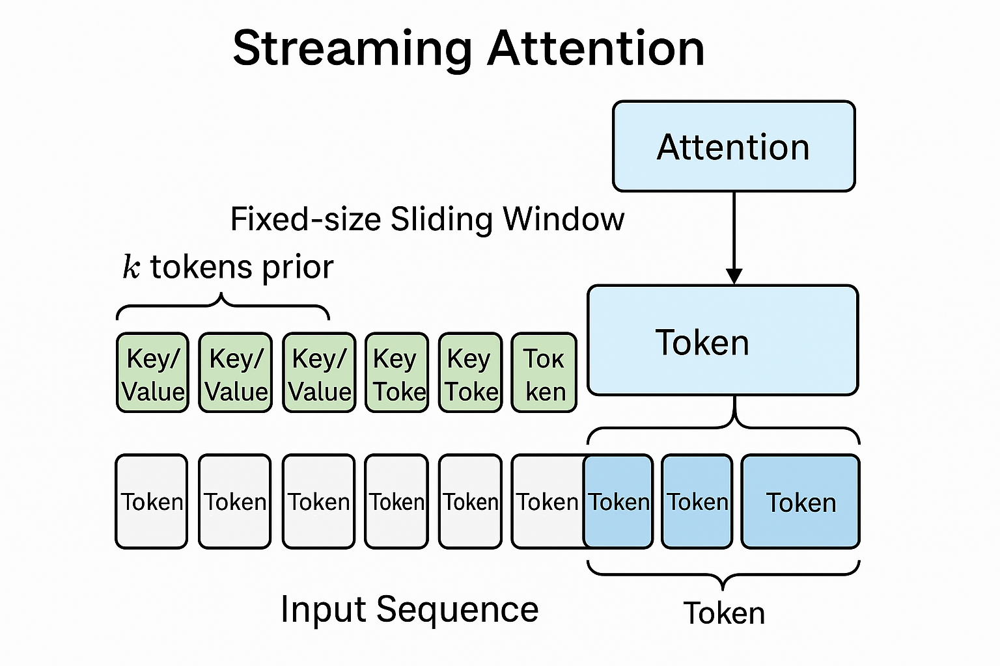
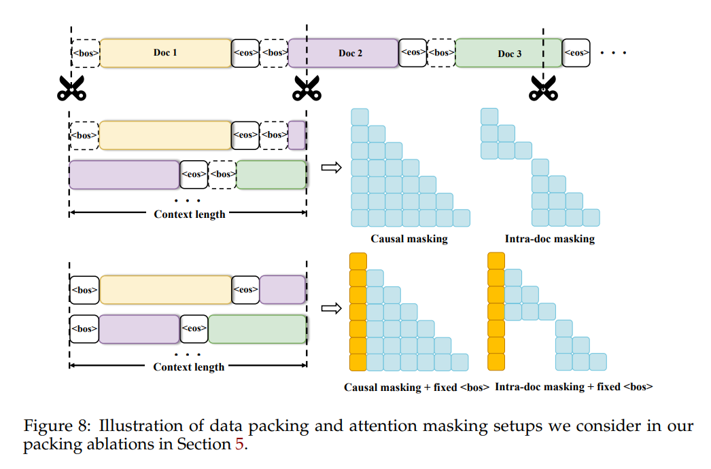

https://www.evanmiller.org/attention-is-off-by-one.html

Add a one in the denominator of softmax

Streaming Attendion

**Streaming attention** is a variant of the attention mechanism used in transformer models (like GPT) that's designed to handle **long or infinite sequences** efficiently, especially in **real-time or low-latency scenarios**, such as live speech transcription, chat systems, or real-time video analysis.

### Why Streaming Attention Is Needed

In standard transformer attention:
- The model attends to **all previous tokens** for every new token.
- This means **memory and compute grow quadratically** with sequence length (`O(n²)`), which becomes infeasible for long inputs or continuous data streams.

### What Streaming Attention Does

Streaming attention modifies this to:
1. **Limit the attention scope**: It only attends to a **fixed-size sliding window** of past tokens (e.g., the last `k` tokens).
2. **Cache key/value states**: It keeps **incremental summaries** of past context so it doesn't need to recompute attention for earlier tokens.
3. Sometimes combines with **recurrent or chunked mechanisms** to simulate long-range dependencies without quadratic costs.

### Variants & Techniques

- **Sliding Window Attention**: Only a recent chunk (e.g., last 128 tokens) is considered for each new token.
- **Stateful Attention**: Caches the key/value pairs from previous segments and reuses them.
- **Chunked Attention**: Splits input into chunks and processes them sequentially with limited context.
- **Attention with Memory**: Adds a memory mechanism (like in Transformer-XL) to retain long-term context beyond the current window.

### Use Cases

- **Real-time transcription** (e.g., voice assistants)
- **Online translation**
- **Chat applications**
- **Streaming video or sensor input analysis**

Would you like a simple diagram or code example to clarify how it works?
## what is rank collapse in transformer


ChatGPT said:
Rank collapse in transformers refers to a phenomenon where the learned representations (such as attention outputs or hidden states) lose diversity and become low-rank, often collapsing into a lower-dimensional subspace. This can severely limit the model's expressiveness and performance.

🔍 What Does "Rank" Mean Here?
In linear algebra, the rank of a matrix is the number of linearly independent rows or columns.

A high-rank matrix has rich, diverse information.

A low-rank matrix means many rows/columns are linearly dependent → less diversity.

🧠 In Transformers:
Transformers compute attention and propagate information through layers.

If all attention outputs (or embeddings) become similar or redundant, their matrix representation becomes low-rank.

This is called rank collapse.

⚠️ Why Is Rank Collapse Bad?
Leads to loss of information.

Degrades model performance and generalization.

Makes deeper layers less useful — the model "forgets" earlier context.

Related to posterior collapse in VAEs and mode collapse in GANs.

🧪 Causes of Rank Collapse
Over-regularization (e.g., strong weight decay).

Poor initialization or layer normalization issues.

Excessive residual connections without variation.

Repeated application of softmax leading to similar attention maps.

Lack of diversity in data.

🛠️ How to Prevent It
Use orthogonal initialization or spectral regularization.

Encourage diversity in attention heads (e.g., with auxiliary loss).

Add LayerNorm in the right places.

Regularization strategies that maximize representation rank (e.g., log-determinant-based losses).

Would you like a code snippet or visualization to help understand how low-rank representations appear?

**Rank collapse** in transformers refers to a phenomenon where the learned representations (such as attention outputs or hidden states) **lose diversity and become low-rank**, often collapsing into a **lower-dimensional subspace**. This can severely limit the model's expressiveness and performance.

---

### 🔍 What Does "Rank" Mean Here?
- In linear algebra, the **rank** of a matrix is the number of linearly independent rows or columns.
- A **high-rank** matrix has rich, diverse information.
- A **low-rank** matrix means many rows/columns are **linearly dependent** → less diversity.

---

### 🧠 In Transformers:
- Transformers compute attention and propagate information through layers.
- If all attention outputs (or embeddings) become similar or redundant, their matrix representation becomes **low-rank**.
- This is called **rank collapse**.

---

### ⚠️ Why Is Rank Collapse Bad?
- Leads to **loss of information**.
- Degrades model performance and generalization.
- Makes deeper layers less useful — the model "forgets" earlier context.
- Related to **posterior collapse** in VAEs and **mode collapse** in GANs.

---

### 🧪 Causes of Rank Collapse
- Over-regularization (e.g., strong weight decay).
- Poor initialization or layer normalization issues.
- Excessive residual connections without variation.
- Repeated application of softmax leading to similar attention maps.
- Lack of diversity in data.

---

### 🛠️ How to Prevent It
- Use **orthogonal initialization** or **spectral regularization**.
- Encourage diversity in attention heads (e.g., with auxiliary loss).
- Add **LayerNorm** in the right places.
- Regularization strategies that **maximize representation rank** (e.g., log-determinant-based losses).

---

Would you like a code snippet or visualization to help understand how low-rank representations appear?

The **norm of the residual stream** in a transformer refers to the **magnitude (usually L2 norm)** of the vector that's passed along the residual (or skip) connections between layers. It's a key signal used to monitor the **information flow and health** of the network during training or inference.

---

### 🔁 What's the "residual stream"?

In transformers, each layer looks like:

```
x → [LayerNorm] → [Self-Attention or Feedforward] → + (residual) → next layer
```

That `+` is the **residual connection**, where the input `x` is added back to the output of the layer. This helps with:
- **Gradient flow** during training (mitigates vanishing gradients)
- **Stabilizing training**
- Preserving **identity information** from earlier layers

The **residual stream** is essentially the vector passed from one layer to the next, accumulating layer outputs plus the original signal.

---

### 📏 What does the norm mean?

The **norm (‖x‖)**—usually the **L2 norm** (Euclidean length)—tells you **how "big" or "active"** that vector is.

- A **very small norm**: may suggest **information is vanishing** (e.g., underfitting, dead neurons)
- A **very large norm**: may indicate **exploding activations** (e.g., instability, overfitting)
- A **steady, healthy norm**: means information is flowing through the network properly

---

### 🧠 Why is this important?

- Researchers (e.g., in Anthropic's **"Transformer Circuits"** work) often analyze **norms of the residual stream** to **debug models**.
- Helps detect **rank collapse**, **saturation**, or **imbalanced layer contributions**
- Can be visualized layer-by-layer to identify **bottlenecks** or **dead areas**

---

Would you like a plotted example of residual stream norms across transformer layers to see what it typically looks like?


# another paper
softmax is not enough (for sharp out-of-distribution)

Sharpness = keep fixated on a fixed number of tokens.

depth vs long context

**Over-squashing** in transformers refers to the **bottlenecking of information** when the model tries to **compress too much input information into a small output representation**, especially in deep architectures or graph-like data. This leads to a loss of useful context and **diminished model performance**.

---

### 🧠 Where It Comes From

The term **originated in graph neural networks (GNNs)**, where distant nodes have to pass messages through narrow bottlenecks (e.g., via mean or attention pooling). But in **transformers**, over-squashing can still happen when:

- A token needs to attend to **a large number of other tokens**.
- The model has **limited capacity** (e.g., small hidden size or low-rank layers).
- Layers are too **shallow**, or **attention is too sparse**, to properly propagate signals.

---

### 🔍 What Happens in Over-Squashing?

- The attention mechanism has to **aggregate information from many places** (other tokens, layers, or heads).
- This aggregation is done via **dot-product attention**, followed by a softmax and a **weighted sum** over value vectors.
- If many important inputs are forced into a single vector (like a funnel), **details get lost**.
- The model becomes **unable to represent complex dependencies** between distant tokens or concepts.

---

### 🧪 Symptoms of Over-Squashing

- **Underperformance on long-context tasks** (e.g., reasoning, long document QA).
- **Flat or compressed value representations** (low-rank or small-norm outputs).
- **Gradient vanishing** across layers or tokens.
- Attention maps showing **over-concentration** (attending to very few tokens repeatedly).

---

### 🛠️ How to Mitigate Over-Squashing

1. **Increase model capacity**:
   - Larger hidden sizes
   - More attention heads or layers

2. **Use long-range attention mechanisms**:
   - Sparse attention (BigBird, Longformer)
   - Global or memory tokens (e.g., Perceiver)
   - Recurrence or recurrence-aware models (e.g., Transformer-XL)

3. **Positional enhancements**:
   - Rotary embeddings (RoPE)
   - Relative position encodings

4. **Architectural innovations**:
   - Depth-wise residual connections
   - Gating mechanisms (e.g., in Gated Transformer-XL)
   - Adding **inductive bias** for better message propagation

---

### 🔁 Related Concepts

- **Rank collapse** – where outputs become low-dimensional (over-squashing often contributes to this).
- **Attention saturation** – when softmax outputs are too peaked or too flat, preventing proper gradient flow.
- **Information bottleneck** – a broader idea of losing information in compressed representations.

---

Would you like a visual illustration comparing information flow with and without over-squashing?
When you see something like **`1ᵗ1 * A`** or **`1ᵗ1 A`** (often written as \( \mathbf{1}^\top \mathbf{1} A \)), it usually involves **multiplying a row vector of ones with itself, then multiplying the result by another matrix `A`**. Let's break this down carefully.

---

### 🔢 Step-by-step:

#### Let:
- \( \mathbf{1} \) be a **column vector of ones**, say of size \( n \times 1 \)
- \( \mathbf{1}^\top \) is then a **row vector of ones**, size \( 1 \times n \)
- So:  
  \[
  \mathbf{1}^\top \mathbf{1} = \sum_{i=1}^n 1 = n
  \]
  This gives just a scalar value: **`n`**

---

### 🧠 Interpretation:

- So, when you multiply **\( \mathbf{1}^\top \mathbf{1} \cdot A \)**, you're really doing:
  \[
  n \cdot A
  \]
  You're just scaling the matrix \( A \) by the number of rows (or columns) in the vector of ones.

---

### ✅ Example:

Suppose:
- \( \mathbf{1} \in \mathbb{R}^{3 \times 1} = \begin{bmatrix}1 \\ 1 \\ 1\end{bmatrix} \)
- \( A = \begin{bmatrix}2 & 3\\ 4 & 5\\ 6 & 7\end{bmatrix} \in \mathbb{R}^{3 \times 2} \)

Then:
- \( \mathbf{1}^\top \mathbf{1} = [1\ 1\ 1] \begin{bmatrix}1 \\ 1 \\ 1\end{bmatrix} = 3 \)
- \( \mathbf{1}^\top \mathbf{1} A = 3A = \begin{bmatrix}6 & 9\\ 12 & 15\\ 18 & 21\end{bmatrix} \)

---

### 🔍 Be Careful — Different Expressions:

1. \( \mathbf{1} \mathbf{1}^\top \): a **matrix of all ones** (shape \( n \times n \))
2. \( \mathbf{1}^\top A \): **row-wise sum** of `A` (if `A` has matching dimensions)
3. \( \mathbf{1}^\top \mathbf{1} A \): just **scaling A by n**

---

Let me know if you're dealing with a specific context like attention mechanisms, where `1ᵗ1` may appear differently.

When you **multiply a matrix of all ones** (let’s call it \( \mathbf{J} \)) with another matrix \( \mathbf{A} \), the result depends on **how you do the multiplication**—on which side and what the dimensions are.

---

### ✅ Define the Matrix of All Ones:

Let’s say:

- \( \mathbf{J}_{m \times n} \) is a matrix where **every entry is 1**
- \( \mathbf{A} \) is a matrix of compatible shape

Now we look at different scenarios:

---

## 👉 Case 1: **Left multiply** – \( \mathbf{J}_{m \times n} \cdot \mathbf{A}_{n \times p} \)

Each row of \( \mathbf{J} \) is `[1 1 1 ... 1]`, so this becomes:

> **Each row in the output is the same: it's the row vector of column sums of `A`.**

### Example:

Let  
\( \mathbf{J}_{2 \times 3} = \begin{bmatrix} 1 & 1 & 1 \\ 1 & 1 & 1 \end{bmatrix} \),  
\( \mathbf{A}_{3 \times 1} = \begin{bmatrix} 2 \\ 3 \\ 4 \end{bmatrix} \)

Then:
\[
\mathbf{J} \cdot \mathbf{A} =
\begin{bmatrix} 1 & 1 & 1 \\ 1 & 1 & 1 \end{bmatrix}
\begin{bmatrix} 2 \\ 3 \\ 4 \end{bmatrix}=
\begin{bmatrix} 9 \\ 9 \end{bmatrix}
\]

You’re summing the elements of \( A \), and copying that result into every row.

---

## 👉 Case 2: **Right multiply** – \( \mathbf{A}_{m \times n} \cdot \mathbf{J}_{n \times p} \)

Now each **column** of the result is the **row sums** of `A`.

### Example:

Let  
\( \mathbf{A}_{2 \times 3} = \begin{bmatrix} 1 & 2 & 3 \\ 4 & 5 & 6 \end{bmatrix} \),  
\( \mathbf{J}_{3 \times 2} = \begin{bmatrix} 1 & 1 \\ 1 & 1 \\ 1 & 1 \end{bmatrix} \)

Then:
\[
\mathbf{A} \cdot \mathbf{J} =
\begin{bmatrix} 1 & 2 & 3 \\ 4 & 5 & 6 \end{bmatrix}
\begin{bmatrix} 1 & 1 \\ 1 & 1 \\ 1 & 1 \end{bmatrix}=
\begin{bmatrix} 6 & 6 \\ 15 & 15 \end{bmatrix}
\]

Each column of the result is the row sums of `A`.

---

## 🤔 Intuition

Multiplying with a matrix of all ones **collapses** or **aggregates** across rows or columns:

- Left multiply \( \rightarrow \) aggregates **columns** (i.e., column sums)
- Right multiply \( \rightarrow \) aggregates **rows** (i.e., row sums)

---

Would you like a diagram or code snippet to visualize this behavior?

The **Lipschitz constant** of a transformer layer measures **how much the output of the layer can change in response to a small change in the input**. It's a formal way to quantify the **sensitivity or stability** of the layer.

---

### 📏 Formal Definition

A function \( f \) is **Lipschitz continuous** if there exists a constant \( L \geq 0 \) such that for all inputs \( x \) and \( y \):

\[
\| f(x) - f(y) \| \leq L \| x - y \|
\]

Here, \( L \) is the **Lipschitz constant**. The smaller \( L \), the more stable and smooth the function is.

---

### 🧠 In a Transformer Layer

A typical transformer layer includes:

1. **Multi-head attention**
2. **Feedforward neural network (MLP)**
3. **LayerNorm**
4. **Residual connections**

The **Lipschitz constant of the full layer** depends on the **combined Lipschitz constants of each sub-component**. Each one contributes to how much the layer's output can "stretch" or "amplify" the input.

---

### 🔎 Why It Matters

- **Stability:** Lower Lipschitz constants imply that the model won’t overreact to small perturbations in input (important for robustness and adversarial resistance).
- **Gradient flow:** If the Lipschitz constant is too small or large, it may cause **vanishing or exploding gradients**.
- **Generalization:** Some theoretical bounds on generalization and robustness rely on Lipschitz properties.
- **Regularization:** Some training methods explicitly **constrain Lipschitz constants** (e.g., spectral norm regularization).

---

### ⚙️ Example in Attention

For a linear layer \( W \), the Lipschitz constant is bounded by its **spectral norm** (i.e., the largest singular value of \( W \)).

For **self-attention**, the Lipschitz constant involves:
- The norms of the **query, key, and value weight matrices**
- The **softmax** (which is 1-Lipschitz under the right norm)
- The **output projection**

So in practice, the **attention mechanism is not strictly 1-Lipschitz**, and its exact constant depends on the layer's learned weights.

---

### 🛠️ Controlling Lipschitz Constants

To regularize or bound a transformer layer’s Lipschitz constant:

- Use **spectral normalization**
- Use **weight clipping** or **weight norm constraints**
- Design **Lipschitz-constrained architectures** (e.g., with norm-preserving layers)

---

Would you like a derivation of the Lipschitz bound for a specific transformer component like attention or the MLP block?



https://sliderspace.baulab.info/

---

### <p style="text-align:center">example text</p>